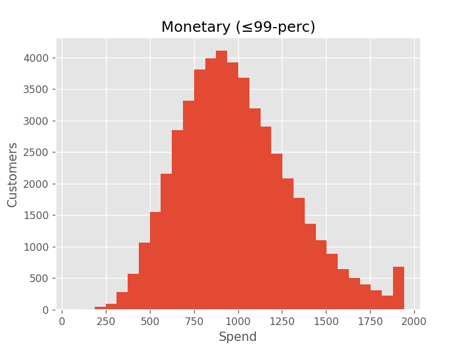

## Overview
End‑to‑end demo on Python + PostgreSQL using a fully synthetic CSV
(~1 M rows, 50 000 customers, year 2019).

* ETL builds a star‑schema automatically.
* RFM, clustering, cohort retention, A/B test.
* Key visualisations included below.

## Quick start
```bash
pip install -r requirements.txt
psql -U <user> -c "CREATE DATABASE demo;"
python pet_project.py
```

## Key charts
### Frequency


### Recency


### Monetary


---
*(See `pet_project.py` for full pipeline.)*
